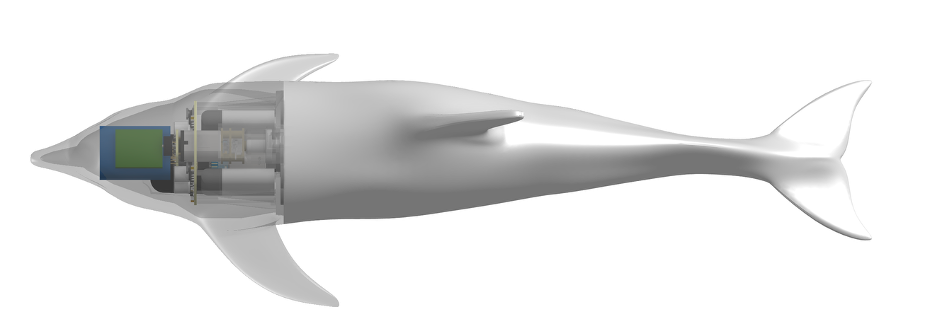

# CAD – Mechanical Design Files



This directory contains all mechanical CAD files for the **Tensegrity Dolphin Robot**, including rigid structural components, flexible tail structures, silicone molding tools, and modular connectors.

The mechanical design follows a **hybrid rigid–soft architecture**:
- A rigid, waterproof head houses all electronics, actuation, and power components.
- A compliant tail enables efficient aquatic locomotion through distributed flexibility.
- Modular connectors allow rapid assembly, disassembly, and tail replacement.

---

## Directory Structure

```
CAD/
├── head/
├── tensegrity_tail/
├── silicone_tail_molding/
├── connectors/
```

---

## Subdirectories

### 1. `head/`
Rigid structural components forming the waterproof head enclosure.

Includes:
- Outer shell and internal mounting frames  
- Motor, pulley, and cable-routing mounts  
- Battery, PCB, and wireless charging coil fixtures  
- Sealing interfaces and fastening features  

These components are designed to be fabricated via **3D printing or CNC machining** and assembled to form a pressure-resistant electronics compartment.

---

### 2. `tensegrity_tail/`
Internal flexible backbone defining the tail’s deformation behavior.

Includes:
- Fish-bone–inspired rigid ribs  
- Interconnecting elements and spacers  
- Cable routing guides and anchor points  

This structure provides **distributed compliance** and enables smooth bending under cable-driven actuation.

---

### 3. `silicone_tail_molding/`
Mold designs used to fabricate the soft silicone tail skin.

Includes:
- Multi-part molds for the outer tail geometry  
- Internal buoyancy chamber molds  
- Alignment, venting, and demolding features  

The molded silicone tail provides continuous curvature, tunable stiffness, and passive compliance for efficient swimming.

---

### 4. `connectors/`
Modular interfaces between the rigid head and the flexible tail.

Includes:
- Magnetic coupling components  
- Mechanical alignment and load-transfer features  

These connectors enable **rapid tail replacement and maintenance** without disassembling the head module.
