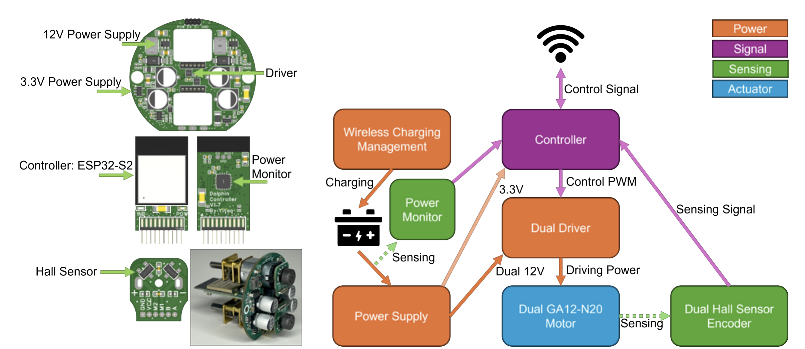

# **PCB Design** 

## 🔗 Access the PCB Design  
The full **schematic, layout, and fabrication files** for the PCB are available in this directory. Please use EasyEDA (LCEDA) to open **ProPrj_Dolphin 3D.epro** for the source.
You can also directly use the Gerber, BOM, and CPL files to produce the board.

  

## 🛠️ Manufacture of this PCB
Recommend using **JLCPCB for production**.

Manufacturing parameters:  
1️⃣ **Main Board** – Use a 1 mm 4-layer board. Others can be default.  
2️⃣ **Controller** – Use a 0.8 mm 4-layer board. Others can be default.  
3️⃣ **Encoder** – Use a 1 mm 2-layer board. Others can be default.  

## 🛍️ Other parts for assembly the robot
You will need these components to build this Dolphin robot. If the link has expired, you can find an equivalent.  

1️⃣ **1.27x10x2p Male Pin Connector** – You need to solder the connector vertically to the Main Board as shown in the `pcb_design` figure.  
2️⃣ **702025 Li-Po Battery 250 mAh** – You need 2 batteries for one robot. [Taobao Link](https://item.taobao.com/item.htm?_u=fb6lncqb37e&id=707886319580&skuId=5171695959474)  
3️⃣ **5F/5.5V 21x10x27mm 16mm-pin Capacitor** – A smaller capacitor may also work, but this is perfectly fit in size. [Tmall Link](https://detail.tmall.com/item.htm?_u=fb6lncq1c6a&id=641504092942&skuId=4790094927334)  
4️⃣ **HK015T.1 Power Switch Chip** – This part is not in the JLCPCB library, so you may need to purchase it yourself. [Taobao Link](https://item.taobao.com/item.htm?_u=fb6lncq935a&id=675015766647&skuId=4893699864706)  
5️⃣ **Tactile switch 4x4x3.5** – This part will be used to control the power of the robot. [Taobao Link](https://item.taobao.com/item.htm?_u=fb6lncq47bf&id=578313422043&skuId=3994993738973)  
6️⃣ **5W receiving module (square 23x30 coil) + 10W transmitting module** – This part is for wireless charging. [Taobao Link](https://item.taobao.com/item.htm?_u=fb6lncq9349&id=681481042391&skuId=5051612254394)  
7️⃣ **Shaft Seal 5x13x5** – This part is for wireless charging. [Taobao Link](https://item.taobao.com/item.htm?_u=fb6lncq98e2&id=652255362545&skuId=4713539808324)  
8️⃣ **Encoder Magnet** – We are using a Radial 6-pole. If you can't find it, other poles may also work. [Taobao Link](https://item.taobao.com/item.htm?_u=fb6lncq2191&id=539394627100)  
9️⃣ **GA12-N20 Motor with rear shaft** – We are using 1:150 gear ratio, 12V, 200RPM (no load). Since we need a lot of this motor, we ordered it from this vendor. You may find other equivalents for a small quantity. [Taobao Link](https://shop108869903.taobao.com/?spm=pc_detail.30350276.shop_block.dshopinfo.2fe07dd6G8NZ3C)  
🔟 **M1.7*6 Self-Tapping Screws** – Use this screw to connect Main Board with 3D printed inner structure. [Tmall Link](https://detail.tmall.com/item.htm?_u=fb6lncqd00d&id=601243288882&skuId=5653049345641)  
1️⃣1️⃣ **M1.6*3 Screws** – Use this screw to connect GA12-N20 Motor with 3D printed inner structure. [Tmall Link](https://detail.tmall.com/item.htm?_u=fb6lncqb704&id=601243200968&skuId=5945136077418)  
1️⃣2️⃣ Wires are needed for assembly, recommend 22AWG or thicker for the power cord. The switch wire can be thin.  
